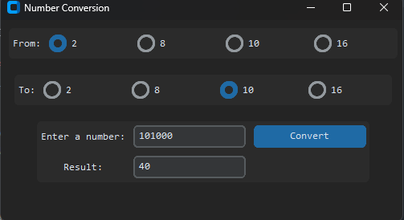
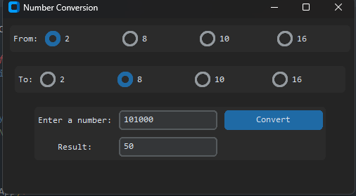
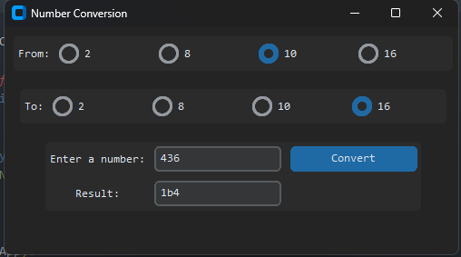

<H1 id="up" align="center" > Calculation System Calculate </H1>

<details>
  <summary>Table of Contents</summary>
  <ol >
    <li >
      <a href="#info">About The Project</a>
      <ul>
        <li><a href="#build_with">Build With</a></li>
      </ul>
    </li>
    <li><a href="#illustration">Illustration</a></li>
    <li><a href="#install">Download</a></li>
    <ul>
        <li><a href="#d_gh">From Github</a></li>
    <ul>
      <li><a href="#d_gh_f">First Method</a></li>
      <li><a href="#d_gh_s">Second Method</a></li>
    </ul>
        <li><a href="#d_db">From DropBox</a></li>
      </ul>
    
  </ol>
</details>


<H2 id="info"> General Info </H2>
The program converts from one number system to another

To be honest, I didn’t really bother with this project. You need it to complete the Python course.

<H3 id="build_with"> Build With: </H3>

* <a href="https://customtkinter.tomschimansky.com/">CustomTkinter </a>
* <a href="https://pyinstaller.org/en/stable/">PyInstaller</a>
* <a href="https://jrsoftware.org/isinfo.php">InnoSetup</a>


<H2 id="illustration"> Illustration </H2>





<H2 id="install"> Download </H2>

If You want You can download it:

> ***24.09.23 Link not checked on other pc's***

<H3 id="d_gh"> From GitHub </H3>

<H4 id="d_gh_f"> <b>First Method: </b> </H4>

1. In the console, you must be in the directory where you want to install the setup file
2. Use this command: 

```
curl -O -L https://github.com/Iwlj4s/calculation_system_calculate/raw/master/Calculation_System_Calculate_Setup.exe
```
*  `-O`  You can change on ` -o file_name_you_want.exe `


* `-L` means "follow location" and is used to have curl automatically follow redirects when downloading a file. Some URLs can be configured to redirect to other URLs, and the -L option allows curl to automatically follow these redirects and retrieve the file from the final location.

<H4 id="d_gh_s"> <b>Second Method: </b> </H4>

>***I have not tested this method***

1. In the console, you must be in the directory where you want to install the setup file
2. Use this command:

```
wget https://github.com/Iwlj4s/calculation_system_calculate/raw/master/Calculation_System_Calculate_Setup.exe
```
* You can use -o and -L in the same way

This will follow the same process of downloading and saving the Calculation_System_Calculate_Setup.exe file from the repository.

<H3 id="d_db"> From DropBox: </H3>

<a href="https://www.dropbox.com/sh/eiew06kmrdptk52/AAB7dx5k2qvrsSqaIwSE8Fb_a?dl=0">Calculation System Calculate</a>
